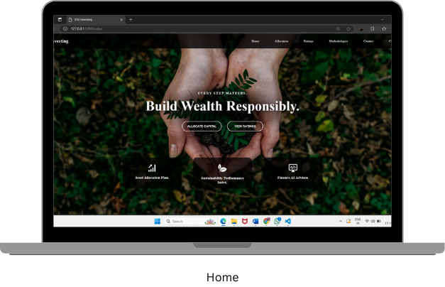

# EcoWise
ESG-Aligned portfolio management application

EcoWise Investment - ESG-Aligned Portfolio Customization Platform

EcoWise Investment is a comprehensive financial platform that empowers investors to make sustainable and profitable investment decisions. The system suggests highly sustainable companies based on Environmental, Social, and Governance (ESG) criteria, helping users align their investments with their personal values while maximizing financial returns.

Key Features:

Customized ESG-Aligned Portfolios: Recommends portfolios tailored to investors’ ESG priorities and risk tolerance, integrating the Black-Litterman model for optimized asset allocation.
Advanced Investment Chatbot: An AI-powered chatbot guides new and experienced investors, providing expert advice, answering queries, and offering personalized recommendations.
Sustainability Tracking: Tracks the performance of companies based on ESG factors, alerting users to any changes in sustainability ratings.
Investor Guidance: Suggests when to continue or stop investments based on market trends and company sustainability scores. This project showcases how modern investment tools can align with responsible investing strategies, catering to both financial growth and social responsibility.

Screenshots:

